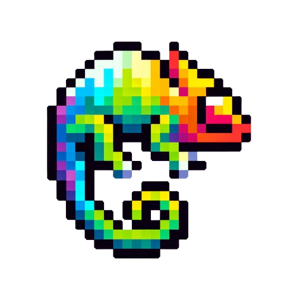

<div align="center">
  
</div>

<div align="center">
    <h1>Generate</h1>
    <p>
        A Python Package to Access World-Class Generative Models.
    </p>
    <p>
        <a href="https://wangyuxinwhy.github.io/generate/">中文文档</a>
        ｜
        <a href="https://colab.research.google.com/github/wangyuxinwhy/generate/blob/main/examples/tutorial.ipynb">交互式教程</a>
    </p>

[](#)
[](https://github.com/wangyuxinwhy/generate/actions/workflows/ci.yml)
[](https://github.com/wangyuxinwhy/generate/actions/workflows/cd.yml)
[](https://github.com/wangyuxinwhy/generate/blob/main/LICENSE)
[](https://wangyuxinwhy.github.io/generate/)
[](#)

</div>
<br>
<br>

# 简介


Generate 允许用户通过统一的 api 访问多平台的生成式模型，当前支持：

| 平台 🤖           | 同步 🔄 | 异步 ⏳ | 流式 🌊 | Vision 👀 | Tools 🛠️ |
| ----------------- | ------- | ------- | ------- | --------- | -------- |
| OpenAI            | ✅      | ✅      | ✅      | ✅        | ✅       |
| Azure             | ✅      | ✅      | ❌      | ✅        | ✅       |
| Anthropic         | ✅      | ✅      | ✅      | ✅        | ❌       |
| 文心 Wenxin       | ✅      | ✅      | ✅      | ❌        | ✅       |
| 百炼 Bailian      | ✅      | ✅      | ✅      | ❌        | ❌       |
| 灵积 DashScope    | ✅      | ✅      | ✅      | ✅        | ❌       |
| 百川智能 Baichuan | ✅      | ✅      | ✅      | ❌        | ❌       |
| Minimax           | ✅      | ✅      | ✅      | ❌        | ✅       |
| 混元 Hunyuan      | ✅      | ✅      | ✅      | ❌        | ❌       |
| 智谱 Zhipu        | ✅      | ✅      | ✅      | ✅        | ✅       |
| 月之暗面 Moonshot | ✅      | ✅      | ✅      | ❌        | ❌       |
| DeepSeek          | ✅      | ✅      | ✅      | ❌        | ❌       |
| 零一万物 Yi       | ✅      | ✅      | ✅      | ✅        | ❌       |
| 阶跃星辰 StepFun  | ✅      | ✅      | ✅      | ✅        | ❌       |

## Features

- **多模态**，支持文本生成，多模态文本生成，结构体生成，图像生成，语音生成...
- **跨平台**，支持 OpenAI，Azure，Minimax，智谱，月之暗面，文心一言 在内的国内外 10+ 平台
- **One API**，统一了不同平台的消息格式，推理参数，接口封装，返回解析，让用户无需关心不同平台的差异
- **异步，流式和并发**，提供流式调用，非流式调用，同步调用，异步调用，异步批量并发调用，适配不同的应用场景
- **自带电池**，提供 chainlit UI，输入检查，参数检查，计费，速率控制，_Agent_, _Tool call_ 等
- **轻量**，最小化依赖，不同平台的请求和鉴权逻辑均为原生内置功能
- **高质量代码**，100% typehints，pylance strict, ruff lint & format, test coverage > 85% ...

## 基础使用

<a target="_blank" href="https://colab.research.google.com/github/wangyuxinwhy/generate/blob/main/examples/tutorial.ipynb">
  
</a>

### 安装

```bash
pip install generate-core
```

### 查看模型列表

```python
from generate.chat_completion import ChatModelRegistry

print('\n'.join([model_cls.__name__ for model_cls, _ in ChatModelRegistry.values()]))

# ----- Output -----
AzureChat
AnthropicChat
OpenAIChat
MinimaxProChat
MinimaxChat
ZhipuChat
ZhipuCharacterChat
WenxinChat
HunyuanChat
BaichuanChat
BailianChat
DashScopeChat
DashScopeMultiModalChat
MoonshotChat
DeepSeekChat
YiChat
```

### 配置模型 API

```python
from generate import WenxinChat

# 获取如何配置文心一言，其他模型同理
print(WenxinChat.how_to_settings())

# ----- Output -----
WenxinChat Settings

# Platform
Qianfan

# Required Environment Variables
['QIANFAN_API_KEY', 'QIANFAN_SECRET_KEY']

# Optional Environment Variables
['QIANFAN_PLATFORM_URL', 'QIANFAN_COMLPETION_API_BASE', 'QIANFAN_IMAGE_GENERATION_API_BASE', 'QIANFAN_ACCESS_TOKEN_API']

You can get more information from this link: https://cloud.baidu.com/doc/WENXINWORKSHOP/s/Dlkm79mnx

tips: You can also set these variables in the .env file, and generate will automatically load them.
```

### 对话补全模型

#### 文本生成

```python
from generate import OpenAIChat

model = OpenAIChat()
model.generate('你好，GPT！', temperature=0, seed=2023)

# ----- Output -----
ChatCompletionOutput(
    model_info=ModelInfo(task='chat_completion', type='openai', name='gpt-3.5-turbo-0613'),
    cost=0.000343,
    extra={'usage': {'prompt_tokens': 13, 'completion_tokens': 18, 'total_tokens': 31}},
    message=AssistantMessage(
        role='assistant',
        name=None,
        content='你好！有什么我可以帮助你的吗？',
        function_call=None,
        tool_calls=None
    ),
    finish_reason='stop'
)
```

#### 多模态文本生成

```python
from generate import OpenAIChat

model = OpenAIChat(model='gpt-4-vision-preview')
user_message = {
    'role': 'user',
    'content': [
        {'text': '这个图片是哪里？'},
        {'image_url': {'url': 'https://dashscope.oss-cn-beijing.aliyuncs.com/images/dog_and_girl.jpeg'}},
    ],
}
model.generate(user_message, max_tokens=1000)

# ----- Output -----
ChatCompletionOutput(
    model_info=ModelInfo(task='chat_completion', type='openai', name='gpt-4-1106-vision-preview'),
    cost=0.10339000000000001,
    extra={'usage': {'prompt_tokens': 1120, 'completion_tokens': 119, 'total_tokens': 1239}},
    message=AssistantMessage(
        role='assistant',
        name=None,
        content='这张图片显示的是一名女士和一只狗在沙滩上。他们似乎在享受日落时分的宁静时刻',
        function_call=None,
        tool_calls=None
    ),
    finish_reason='stop'
)
```

### 派生功能

#### 结构体生成

```python
from generate import OpenAIChat
from pydantic import BaseModel

class Country(BaseModel):
    name: str
    capital: str

model = OpenAIChat().structure(output_structure_type=Country)
model.generate('Paris is the capital of France and also the largest city in the country.')
# ----- Output -----
StructureModelOutput(
    model_info=ModelInfo(task='chat_completion', type='openai', name='gpt-3.5-turbo-0613'),
    cost=0.000693,
    extra={'usage': {'prompt_tokens': 75, 'completion_tokens': 12, 'total_tokens': 87}},
    structure=Country(name='France', capital='Paris')
)
```

#### 速率限制

```python
import time
from generate import OpenAIChat

# 限制速率，每 10 秒最多 4 次请求
limit_model = OpenAIChat().limit(max_generates_per_time_window=2, num_seconds_in_time_window=10)
start_time = time.time()
for i in limit_model.batch_generate([f'1 + {i} = ?' for i in range(4)]):
    print(i.reply)
    print(f'elapsed time: {time.time() - start_time:.2f} seconds')

# ----- Output -----
1
elapsed time: 0.70 seconds
2
elapsed time: 1.34 seconds
3
elapsed time: 11.47 seconds
4
elapsed time: 12.15 seconds
```

#### 对话历史保持

```python
from generate import OpenAIChat

session_model = OpenAIChat().session()
session_model.generate('i am bob')
print(session_model.generate('What is my name?').reply)

# ----- Output -----
Your name is Bob.
```

#### 工具调用

```python
from generate import OpenAIChat, tool

@tool
def get_weather(location: str) -> str:
    return f'{location}, 27°C, Sunny'

agent = OpenAIChat().agent(tools=get_weather)
print(agent.generate('what is the weather in Beijing?').reply)

# ----- Output -----
The weather in Beijing is currently 27°C and sunny.
```

### 图像生成模型

```python
from generate import OpenAIImageGeneration

model = OpenAIImageGeneration()
model.generate('black hole')

# ----- Output -----
ImageGenerationOutput(
    model_info=ModelInfo(task='image_generation', type='openai', name='dall-e-3'),
    cost=0.56,
    extra={},
    images=[
        GeneratedImage(
            url='https://oaidalleapiprodscus.blob.core.windows.net/...',
            prompt='Visualize an astronomical illustration featuring a black hole at its core. The black hole
should be portrayed with strong gravitational lensing effect that distorts the light around it. Include a
surrounding accretion disk, glowing brightly with blue and white hues, streaked with shades of red and orange,
indicating heat and intense energy. The cosmos in the background should be filled with distant stars, galaxies, and
nebulas, illuminating the vast, infinite space with specks of light.',
            image_format='png',
            content=b'<image bytes>'
        )
    ]
)
```

### 语音生成模型

```python
from generate import MinimaxSpeech

model = MinimaxSpeech()
model.generate('你好，世界！')

# ----- Output -----
TextToSpeechOutput(
    model_info=ModelInfo(task='text_to_speech', type='minimax', name='speech-01'),
    cost=0.01,
    extra={},
    audio=b'<audio bytes>',
    audio_format='mp3'
)
```

### 多种调用方式

```python
from generate import OpenAIChat

model = OpenAIChat()
for stream_output in model.stream_generate('介绍一下唐朝'):
    print(stream_output.stream.delta, end='', flush=True)

# 同步调用，model.generate
# 异步调用，model.async_generate
# 流式调用，model.stream_generate
# 异步流式调用，model.async_stream_generate
# 批量调研，model.batch_generate
# 异步批量调用，model.async_batch_generate
```

### 启动 chainlit UI

```bash
python -m generate.ui
# help
# python -m generate.ui --help
```
